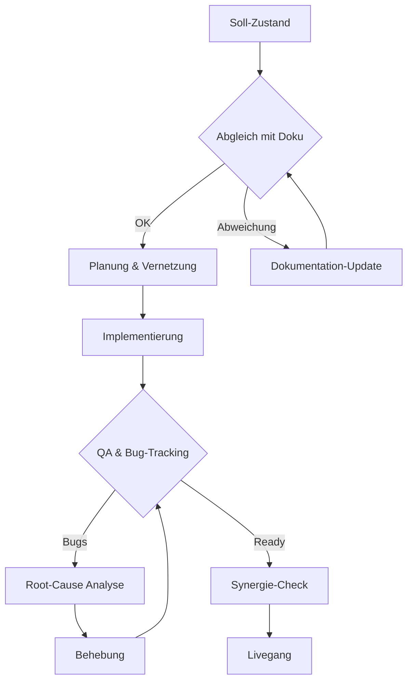
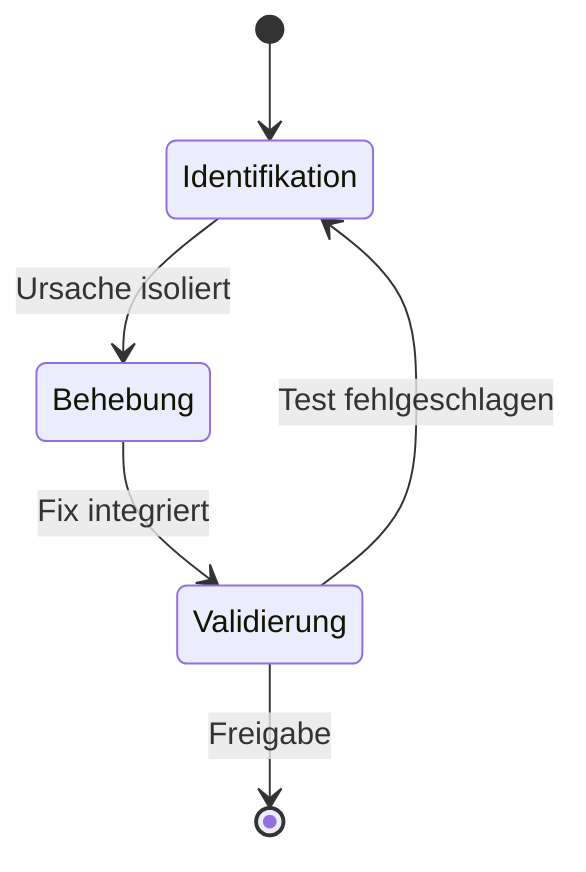
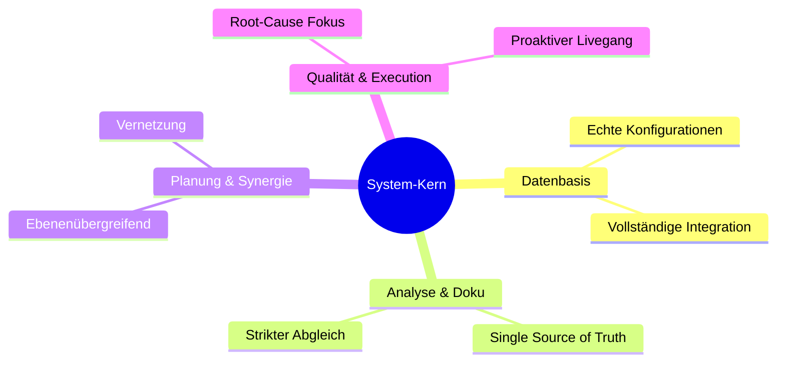

# System- und Prozess-Grafiken

## 1. Execution Pipeline

## 2. QA State Diagram

## 3. System-Architektur

## 4. Design-Vorgaben
- **Theme:** Dark Mode, Shadcn UI
- **Keine 3D-Effekte,** flaches Design
- **Typografie:** Serifenlos, modern
- **Fokus auf Daten & Struktur**
